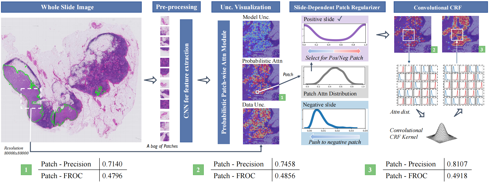

# Bayes-MIL: A New Probabilistic Perspective on Attention-based Multiple Instance Learning for Whole Slide Images

This repository is the implementation of [Bayes-MIL: A New Probabilistic Perspective on Attention-based Multiple Instance Learning for Whole Slide Images](https://openreview.net/forum?id=_geIwiOyUhZ). Parts of this project use code from [CLAM](https://github.com/mahmoodlab/CLAM). 



## Requirements

Use the environment configuration the same as [CLAM](https://github.com/mahmoodlab/CLAM).


## Data preprocessing

1. Create patches
```shell
python create_patches_fp.py --source DIR_TO_SLIDE_FILE --save_dir SAVE_DIR --patch_size 256 --seg --patch --stitch
```

2. Extract patch features
```shell
CUDA_VISIBLE_DEVICES=0,1 python extract_features_fp.py --data_h5_dir DIR_TO_COORDS --data_slide_dir DATA_DIRECTORY --csv_path CSV_FILE_NAME --feat_dir FEATURES_DIRECTORY --batch_size 512 --slide_ext .svs
```

3. Prepare the data in the `dataset_csv` folder.
   
   Datasets are expected to be prepared in a csv format containing at least 3 columns: case_id, slide_id, and labels columns for the slide-level labels. 


4. Split the data into k-fold(e.g. 10-fold), then save the splited data in the following format as in `splits/x/splits_x.csv`.
```bash
python create_splits_seq.py --task task_1_tumor_vs_normal --seed 1 --label_frac 0.75 --k 10
```

5. Calculate the shape of images.

Create a `images_shape.txt` file that stored with slide name, width and height of each slide at level 0.
```bash
python get_image_shape.py
```

### Synthetic MNIST dataset for experimentation

To quickly validate the Bayes-MIL models without preparing whole-slide images,
generate a toy dataset derived from MNIST:

```bash
python processing_scripts/create_mnist_synthetic_dataset.py \
    --output-dir /path/to/mnist_mil_dataset \
    --dataset mnist_fourbags
```

The command writes the expected `h5_files/`, metadata CSV file, and
cross-validation splits for the requested task. Each HDF5 slide now also stores
the sampled digit `numbers`, optional `instance_labels`, and evidence vectors
under `evidence/<class_id>` so the interpretability ground truth can be
recovered alongside the flattened pixels and coordinates. The CSV exposes a
numeric `label` column alongside a human-readable `label_name` column that
follow the original rule set implemented by the `FourBagsDataset` class. Run
the command again with a different `--dataset` value to create the other
variants independently. Refer to
[docs/mnist_synthetic_dataset.md](docs/mnist_synthetic_dataset.md) for additional options,
example training commands, and a short Python walkthrough showing how to inspect the
generated slides from code.

To preview a handful of MNIST slides directly from Python, run:

```bash
python examples/mnist_dataset_example.py \
    --dataset-root /path/to/mnist_mil_dataset \
    --task mnist_fourbags --split test --fold 0 --max-slides 3
```

After training MNIST checkpoints, forward the same dataset and experiment code to
`examples/mnist_evaluate.py` with `--run-explainability` to export the
interpretability metrics captured by `eval.py`:

```bash
python examples/mnist_evaluate.py \
    --dataset-root /path/to/mnist_mil_dataset \
    --task mnist_fourbags \
    --exp-code mnist_demo \
    --k 5 \
    --run-explainability
```

The helper writes per-fold `_explainability.csv` files under `eval_results/` and
merges the aggregated metrics into the final summary CSV. The
`--explanation-type` flag accepts either comma **or whitespace** separated
values and overrides the automatic defaults. By default the evaluation filters
the explanation names to the subset supported by the chosen `--model_type`:

* **attention_mil** models (`bmil-vis`, `bmil-enc`, `bmil-spvis`, etc.) evaluate
  `learn`, `int-attn-coeff`, and `int-computed`.
* **additive_mil** models (`bmil-addvis`, `bmil-addenc`, `bmil-addspvis`) add the
  `int-built-in` explanation.
* **conjunctive_mil** models (`bmil-conjvis`, `bmil-convis`, `bmil-conjenc`,
  `bmil-conenc`, `bmil-conjspvis`, `bmil-conspvis`) use `learn`,
  `int-attn-coeff`, and `int-built-in`.
* **trans_mil** models default to `learn`, `int-attn-coeff`, and `int-computed`.

Each record now includes the checkpoint filename in a `model_identifier`
column, and the CLI prints a one-line summary for every
`(model_identifier, explanation_type)` pair so you can immediately see which
interpretability method was applied to each model.

## Training
1. Modify the format of the input data.

For data loading, look under `datasets/dataset_generic.py`:
```bash
	def __getitem__(self, idx):
		slide_id = self.slide_data['slide_id'][idx]
		label = self.slide_data['label'][idx]
		if type(self.data_dir) == dict:
			source = self.slide_data['source'][idx]
			data_dir = self.data_dir[source]
		else:
			data_dir = self.data_dir

		full_path = os.path.join(data_dir, 'h5_files', '{}.h5'.format(slide_id))
		with h5py.File(full_path, 'r') as hdf5_file:
			features = hdf5_file['features'][:]
			coords = hdf5_file['coords'][:]

		features = torch.from_numpy(features)
		coords = torch.from_numpy(coords)
		w, h = self.shape_dict[slide_id]
		return slide_id, features, label, coords, w, h
```
* `slide_id`: Name of slide.
* `features`: Features of all patches in the slide.
* `label`: Label of slide (0 or 1)
* `coords`: The top-left coordinates of all patches in the slide.
* `w`: Width of the slide.
* `h`: Height of the slide.


2. Bayes-MIL.

We consider 3 variants of Bayes-MIL: 1) Bayes-MIL-Vis: The Bayesian modelling of MIL. 2) Bayes-MIL-SDPR: The model with slide-dependent patch regularizer. 3) Bayes-MIL-APCRF: The whole model, including SDPR and the approximate CRF.


For training, look under `models/model_bmil.py`:
```bash
bMIL_model_dict = {
                    'vis': probabilistic_MIL_Bayes_vis,
                    'addvis': probabilistic_Additive_MIL_Bayes_vis,
                    'conjvis': probabilistic_Conjunctive_MIL_Bayes_vis,
                    'enc': probabilistic_MIL_Bayes_enc,
                    'spvis': probabilistic_MIL_Bayes_spvis,
}
```
>📋 Update `--model_type` to the corresponding model.
* `bmil-vis`: Bayes-MIL-Vis
* `bmil-addvis`: Additive Bayes-MIL-Vis
* `bmil-conjvis`: Conjunctive Bayes-MIL-Vis (legacy alias: `bmil-convis`)
* `bmil-enc`: Bayes-MIL-SDPR
* `bmil-addenc`: Additive Bayes-MIL-SDPR
* `bmil-conjenc`: Conjunctive Bayes-MIL-SDPR (legacy alias: `bmil-conenc`)
* `bmil-spvis`: Bayes-MIL-APCRF
* `bmil-addspvis`: Additive Bayes-MIL-APCRF
* `bmil-conjspvis`: Conjunctive Bayes-MIL-APCRF (legacy alias: `bmil-conspvis`)

```shell
CUDA_VISIBLE_DEVICES=0 nohup python -u main.py --drop_out --early_stopping --lr 1e-4 --k 10 --label_frac 0.75 --exp_code task_1_tumor_vs_normal_CLAM_75 --weighted_sample --bag_loss ce --inst_loss svm --task task_1_tumor_vs_normal --model_type bmil-vis --log_data --data_root_dir FEATURES_DIRECTORY &
```


## Evaluation
By adding your own custom datasets into `eval.py` the same way as you do for `main.py`. Modify the `--model_type` to the corresponding model.
```bash
CUDA_VISIBLE_DEVICES=0 python eval.py --drop_out --k 10 --models_exp_code task_1_tumor_vs_normal_CLAM_75 --save_exp_code task_1_tumor_vs_normal_CLAM_75 --task task_1_tumor_vs_normal --model_type bmil-vis --results_dir results --data_root_dir DATA_ROOT_DIR
```

### Explainability add-on

The evaluation script can optionally compute the instance-level and attention-based
interpretability metrics that mirror the reference leaderboard submission. Enable
this pass with `--run-explainability`; the command below evaluates the same model
checkpoint while writing per-fold interpretability CSV files alongside the
standard bag-level summary.

```bash
CUDA_VISIBLE_DEVICES=0 python eval.py --drop_out --k 10 --models_exp_code task_1_tumor_vs_normal_CLAM_75 --save_exp_code task_1_tumor_vs_normal_CLAM_75 --task task_1_tumor_vs_normal --model_type bmil-vis --results_dir results --data_root_dir DATA_ROOT_DIR --run-explainability --explanation-type all --explainability-model-mode validation
```

Key flags:

* `--run-explainability`: toggles the interpretability evaluation.
* `--explanation-type`: comma or whitespace separated list of explanation heads
  to score (e.g. `learn learn-plus int-attn-coeff`) or `all` to request every
  explanation supported by the selected model architecture.
* The script automatically filters unsupported explanation names for the chosen
  `--model_type` and reports the effective selection before running the
  interpretability pass.
* `--explainability-model-mode`: forwarded to the model so the same evaluation
  code can be used across `validation`, `test`, or any custom forward modes.

## Heatmap Visualization

Modify the `heatmaps/configs/config_template.yaml` to filling out the config. The heatmaps will be saved in `heatmaps/heatmap_raw_results`.
```shell
CUDA_VISIBLE_DEVICES=0 nohup python -u create_heatmaps_bmil.py --config config_template.yaml &
```

## License

This code is made available under the GPLv3 License and is available for non-commercial academic purposes.

## Reference

Please cite our paper if you use the core code of Bayes-MIL. 

Yufei, Cui, et al. "Bayes-MIL: A New Probabilistic Perspective on Attention-based Multiple Instance Learning for Whole Slide Images." The Eleventh International Conference on Learning Representations. 2023.

```
@inproceedings{yufei2023bayes,
  title={Bayes-MIL: A New Probabilistic Perspective on Attention-based Multiple Instance Learning for Whole Slide Images},
  author={Yufei, Cui and Liu, Ziquan and Liu, Xiangyu and Liu, Xue and Wang, Cong and Kuo, Tei-Wei and Xue, Chun Jason and Chan, Antoni B},
  booktitle={The Eleventh International Conference on Learning Representations},
  year={2023}
}
```
